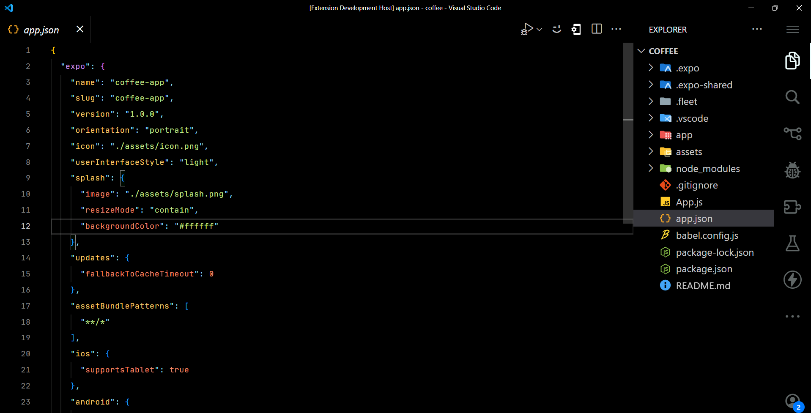

# Shadow Flux

A sleek and minimal dark theme for Visual Studio Code designed to enhance your coding experience with subtle shadows and a refined aesthetic.

## Features

- **Minimal Design**: Focus on your code with a clean and unobtrusive interface.
- **Dark Palette**: Soft and dark colors reduce eye strain and keep your workspace comfortable.
- **Shadow Effects**: Subtle shadow effects add depth to the editor, making it visually appealing.
- **Customizable**: Easily adjust settings to match your personal style.

## Installation

1. Open Visual Studio Code.
2. Go to the Extensions view by clicking on the Extensions icon in the Activity Bar on the side of the window.
3. Search for **Shadow Flux**.
4. Click **Install**.

## Usage

To activate the theme:

1. Open the Command Palette (Ctrl + Shift + P or Cmd + Shift + P on macOS).
2. Type `Preferences: Color Theme` and select **Shadow Flux** from the list.

## Preview

## Contributing

Contributions are welcome! If you have suggestions or improvements, feel free to open an issue or submit a pull request.

## License

This theme is licensed under the MIT License.

## Author

Made with ❤️ by [Salim Rutaganda](https://github.com/rutaganda-salim)

## GitHub Repository

Find the source code and contribute to the project on [GitHub](https://github.com/rutaganda-salim/shadowflux).
